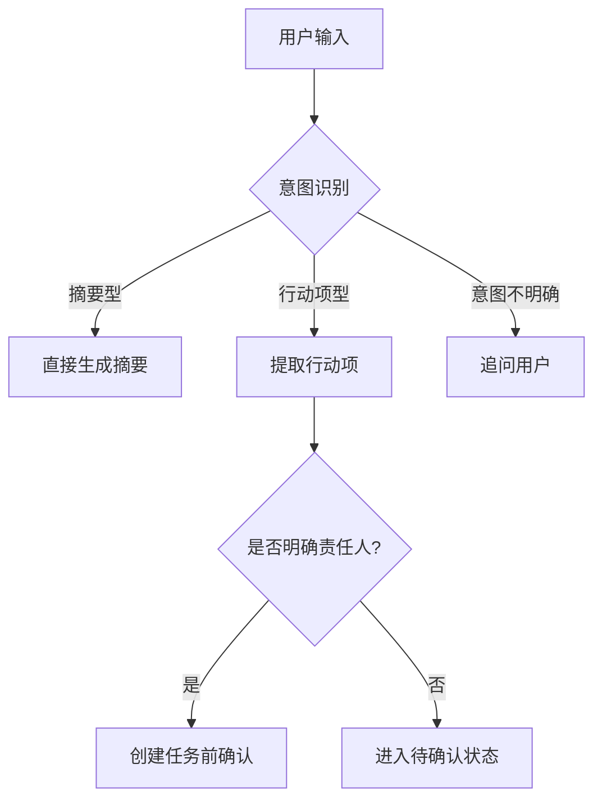

# Agent PRD 写作指南

## 核心认知：Agent PRD vs 传统 PRD

Agent 产品与传统产品的根本差异决定了 PRD 写法完全不同：

| 维度 | 传统产品 | Agent 产品 |
|------|----------|------------|
| 系统行为 | 可预期（点 A → 跳 B） | 不确定（持续理解 → 决策 → 行动） |
| 核心隐喻 | 自动售货机（按钮 → 固定结果） | 聪明同事（理解意图 → 判断 → 行动） |
| PRD 重点 | 页面结构、交互流程、字段规则 | **意图识别、决策逻辑、边界控制** |
| 真正的"功能" | 按钮、页面 | **决策** |

**关键转变：** 不是从"页面"开始写，而是从"意图"开始写。Agent PRD 的骨架是：

```
用户意图 → 工具调用规则 → 边界条件
```

这三件事才是 Agent PRD 的核心，因为 Agent 产品最关键的问题不是"长什么样"，而是：
- 在什么意图下，系统该采取什么行动？
- 行动能做到什么程度？
- 什么情况下必须停下来？

> **金句速查：**
> 1. 传统 PM 写的是"功能说明书"，Agent PM 写的是"系统决策说明书"
> 2. Agent PRD 的第一步，不是定义功能，是定义意图空间
> 3. 工具调用不是 Agent 的附加能力，工具调用本身就是产品决策
> 4. 传统 PRD 的异常处理是为了兜底，Agent PRD 的边界条件是为了控权
> 5. Agent 产品最难的，不是"把 AI 接进来"，而是"让 AI 在该做的时候做，在不该做的时候停"

---

## 第一步：场景定义（为什么需要 Agent？）

在写任何 PRD 内容之前，先回答：**这件事为什么适合用 Agent，而不是传统功能？**

| 项目 | 说明 |
|------|------|
| 用户是谁 | 目标用户画像 |
| 发生在什么场景 | 使用场景描述 |
| 用户原本怎么完成 | 现有解决方案 |
| 原流程的主要摩擦点 | 痛点分析 |
| 为什么适合用 Agent | 而非传统功能解 |

> **伪 AI 需求过滤器：** 如果一件事规则极稳定、输入极结构化、无需多轮判断，其实不一定需要上 Agent。

---

## 第二步：用户意图拆解

> **意图 ≠ 用户说了什么，意图 = 用户到底要完成什么。**

同一句话背后的真实意图可能完全不同。如果不先拆意图，后面所有设计都会虚。

### 意图结构表

为每种意图填写下表：

| 字段 | 说明 |
|------|------|
| 意图名称 | 该意图的标识名 |
| 触发方式 | 什么条件下触发 |
| 典型表达 | 用户可能怎么描述 |
| 真实目标 | 用户真正想完成的事 |
| 优先级 | 与其他意图的优先关系 |
| 是否允许自动执行 | 还是必须用户确认 |
| 是否需要二次确认 | 哪些步骤需要确认 |

### 意图拆解示例

以"帮我整理一下这份会议纪要"为例，至少拆为 4 种意图：

| 意图 | 真实目标 | 典型场景 |
|------|----------|----------|
| 摘要型 | 快速了解会议要点 | 会后快速回顾 |
| 行动项提取型 | 明确谁做什么 | 任务推进 |
| 汇报材料型 | 生成正式纪要 | 向上汇报 |
| 知识沉淀型 | 归档为可检索知识 | 团队知识管理 |

### 关键要求

- **意图空间必须穷举**：覆盖主要场景，标注兜底策略
- **意图之间有优先级**：冲突时谁优先
- **允许多意图并存**：用户一句话可能包含多个意图
- **意图识别失败要有处理方式**：不能硬答，要追问或澄清

---

## 第三步：决策路径（核心）

描述用户输入后，系统的判断流程：

1. 用户输入后，系统先判断什么？
2. 满足什么条件，进入哪条路径？
3. 哪一步触发工具调用？
4. 哪一步要求用户确认？
5. 哪一步直接输出结果？

对于复杂场景，建议画 Mermaid 流程图。示例结构：



---

## 第四步：工具调用规则

> **工具调用不是能力清单，是决策条件。**
> **工具多 ≠ 产品设计好。该调才调，不该调别调。**

### 错误写法 vs 正确写法

**错误（功能列表式）：**
- 支持调用搜索
- 支持调用知识库
- 支持调用工单系统

**正确（决策条件式）：**
- 在什么情况下调用搜索
- 在什么情况下优先查知识库
- 在什么情况下禁止直接调用外部工具
- 工具调用失败后，系统回退到哪一步
- 多工具冲突时，谁优先

### 工具调用必须写清的 4 个问题

**① 调用前提是什么？**
- 不是所有请求都该调工具
- 用户问常识问题 → 不该先翻企业知识库
- 用户表达模糊 → 不该直接创建任务
- **Agent 不是"能调就调"，而是"该调才调"**

**② 调用顺序是什么？**
- 先查记忆？先查知识库？先走搜索？先让用户补充信息？
- 顺序直接影响结果质量和响应速度

**③ 调用目标是什么？**

| 调用目标 | 设计差异 |
|----------|----------|
| 补信息 | 返回结果融入回答 |
| 执行动作 | 需要确认机制 |
| 结果校验 | 需要对比逻辑 |

**④ 调用后怎么收束？**
- 直接给结果？
- 展示中间过程？
- 让用户确认后再执行下一步？

### 工具调用规则表模板

| 字段 | 说明 |
|------|------|
| 工具名称 | 工具标识 |
| 调用目的 | 补信息 / 执行动作 / 结果校验 |
| 触发条件 | 满足什么条件才调用 |
| 禁止条件 | 什么情况下绝不调用 |
| 调用顺序 | 在整体流程中的位置 |
| 失败降级逻辑 | 失败后回退哪一步 / 降级策略 |
| 返回结果使用方式 | 直接展示 / 融入回答 / 作为下一步输入 |

---

## 第五步：边界条件

> **传统 PRD 的异常处理是为了兜底。Agent PRD 的边界条件是为了控权。**

Agent 天然存在不确定性：可能理解错、查不到、工具超时、信息冲突、做得太多或太少。边界条件不是角落，是主流程的一部分。

### 必须写清的 5 类边界条件

**① 信息不足**
- 用户表达太模糊，无法判断真实意图
- **必须明确**：是否追问 / 追问几轮 / 追问失败后怎么收束
- 不能硬答

**② 工具失败**
- 知识库无返回 / 接口超时 / 权限不够 / 外部系统失败
- **必须明确**：降级回答 / 明确报错 / 保留草稿

**③ 高风险动作**
- 发消息、改数据、提交审批、删除内容
- **必须分类**：
  - 哪些必须确认
  - 哪些可以自动执行
  - 哪些永远不能自动执行

**④ 多解冲突**
- 搜索结果和知识库结果冲突
- **必须明确**：优先哪边 / 展示冲突给用户 / 合并策略
- 这类设计决定的是**信任感**

**⑤ 幻觉与越权**
- 模型没有依据时，能不能生成？如果不能，怎么说？
- 用户要求超出权限范围时，系统怎么拒绝？
- **这部分写不好，产品上线后一定出事故**

### 边界条件完整清单

写完后逐一核对：

- [ ] 信息不足（模糊意图处理）
- [ ] 工具失败（降级策略）
- [ ] 权限不足（越权拒绝）
- [ ] 高风险动作（确认机制）
- [ ] 数据冲突（多源矛盾）
- [ ] 幻觉控制（无依据生成）
- [ ] 用户打断（中途取消）
- [ ] 多轮上下文丢失（会话衰减）

---

## 第六步：结果定义

明确什么是"完成"：

| 状态 | 定义 |
|------|------|
| 任务完成 | 什么叫"做完了" |
| 部分完成 | 什么叫"做了一部分但有价值" |
| 失败但有中间结果 | 什么叫"失败了但结果可用" |

补充说明：
- 用户需要看到哪些过程信息
- 哪些结果可以直接复用为下一步输入

---

## 第七步：评估指标

上线后如何衡量 Agent 表现：

| 指标类别 | 具体指标 |
|----------|----------|
| 意图识别 | 意图识别成功率 |
| 工具调用 | 工具调用成功率 |
| 任务完成 | 单轮任务完成率 / 多轮任务完成率 |
| 用户行为 | 用户确认率 / 结果采纳率 |
| 安全控制 | 高风险误触发率 / 人工接管率 |

---

## Agent PRD 完整模板速查

将以上步骤整合为以下文档结构：

```
1. 场景定义
   - 用户是谁
   - 使用场景
   - 现有方案痛点
   - 为什么适合 Agent

2. 意图拆解
   - 核心意图列表
   - 每种意图的典型表达
   - 意图间优先级
   - 多意图并存规则
   - 意图识别失败处理

3. 决策路径
   - 判断流程
   - 工具调用触发点
   - 用户确认点
   - 直接输出点

4. 工具调用规则
   - 每种工具的：名称/目的/触发条件/禁止条件
   - 失败降级逻辑
   - 返回结果使用方式

5. 边界条件
   - 信息不足 / 工具失败 / 权限不足
   - 高风险动作 / 数据冲突 / 幻觉控制
   - 用户打断 / 多轮上下文丢失

6. 结果定义
   - 完成 / 部分完成 / 失败有中间结果
   - 过程信息展示
   - 结果复用规则

7. 评估指标
   - 意图识别 / 工具调用 / 任务完成
   - 用户行为 / 安全控制
```

---

## 实战示例：AI 会议助手 Agent PRD

### 场景定义

- **目标用户**：中层管理者、项目经理
- **核心问题**：会后整理耗时、行动项容易漏、责任人不清、纪要难转化为推进动作
- **为什么用 Agent**：会议内容非结构化、用户意图多样、需要多步推理

### 意图拆解

| 意图 | 真实目标 | 典型表达 |
|------|----------|----------|
| 快速回顾型 | 3 分钟了解会议要点 | "帮我总结一下刚才的会" |
| 任务推进型 | 明确谁做什么、什么时候完成 | "帮我整理待办" |
| 向上汇报型 | 生成正式纪要发给领导 | "帮我写份会议纪要" |
| 知识沉淀型 | 归档为可检索知识 | "把这个会存到项目文档里" |

### 工具调用逻辑

| 意图 | 调用工具 | 确认要求 |
|------|----------|----------|
| 快速回顾 | 转写 + 摘要 | 无需确认 |
| 任务推进 | 转写 + 摘要 + 任务系统 | **创建任务前必须确认责任人与截止时间** |
| 向上汇报 | 转写 + 纪要模板生成 | 纪要发送前确认 |
| 知识沉淀 | 转写 + 知识库写入 | 写入前确认分类标签 |

### 边界条件

- 会议内容信息缺失 → **不自动补责任人**
- 未明确责任人的待办 → **只进入"待确认"状态**
- 任务系统调用失败 → **先保留草稿，不直接丢失**
- 涉及外部参会者信息 → **不自动写入企业内部知识库**

---

## 自检清单（写完 PRD 后必问 3 个问题）

- [ ] **我写清楚用户意图了吗？**（意图空间是否穷举？优先级是否明确？）
- [ ] **我写清楚工具为什么在这里调用了吗？**（触发条件、禁止条件、降级逻辑是否完整？）
- [ ] **我写清楚边界条件了吗？**（信息不足、工具失败、高风险动作、幻觉控制是否覆盖？）

> 如果这 3 个问题里有一个答不上来，大概率不是文档不完整，而是产品设计还没真正完成。
