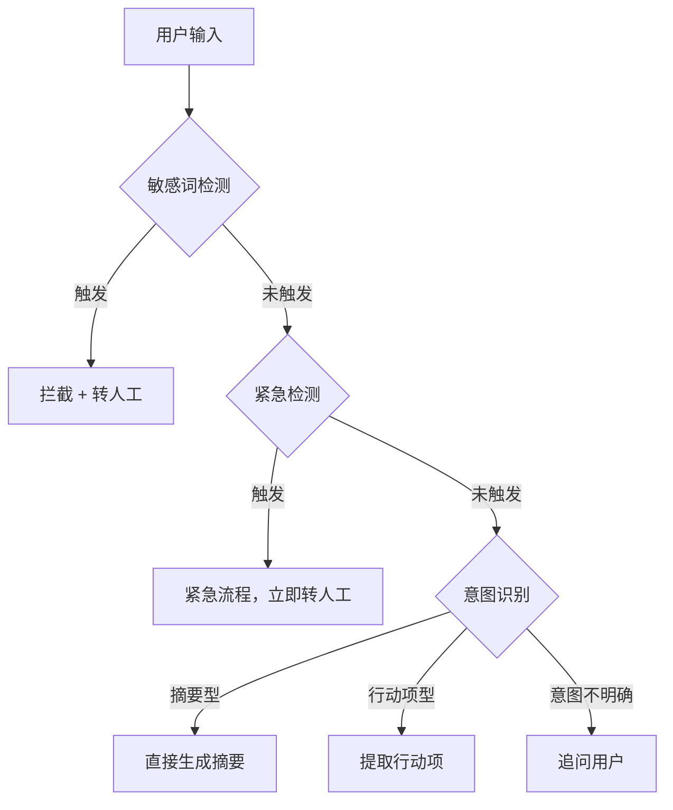

# Agent PRD 写作指南 v2.0

## 核心认知：Agent PRD vs 传统 PRD

Agent 产品与传统产品的根本差异决定了 PRD 写法完全不同：

| 维度 | 传统产品 | Agent 产品 |
|------|----------|------------|
| 系统行为 | 可预期（点 A → 跳 B） | 不确定（持续理解 → 决策 → 行动） |
| 核心隐喻 | 自动售货机（按钮 → 固定结果） | 聪明同事（理解意图 → 判断 → 行动） |
| PRD 重点 | 页面结构、交互流程、字段规则 | **意图识别、决策逻辑、边界控制** |
| 真正的"功能" | 按钮、页面 | **决策** |

**关键转变：** 不是从"页面"开始写，而是从"意图"开始写。Agent PRD 的骨架是：

```
用户意图 → 工具调用规则 → 边界条件
```

这三件事才是 Agent PRD 的核心，因为 Agent 产品最关键的问题不是"长什么样"，而是：
- 在什么意图下，系统该采取什么行动？
- 行动能做到什么程度？
- 什么情况下必须停下来？

> **金句速查：**
> 1. 传统 PM 写的是"功能说明书"，Agent PM 写的是"系统决策说明书"
> 2. Agent PRD 的第一步，不是定义功能，是定义意图空间
> 3. 工具调用不是 Agent 的附加能力，工具调用本身就是产品决策
> 4. 传统 PRD 的异常处理是为了兜底，Agent PRD 的边界条件是为了控权
> 5. Agent 产品最难的，不是"把 AI 接进来"，而是"让 AI 在该做的时候做，在不该做的时候停"
> 6. **没有槽位定义的 Agent PRD，研发无法落地**
> 7. **没有 API 契约的 Agent PRD，前后端无法并行**

---

## 第零步：研发就绪度检查

> 在开始写作前，先确认本文档的目标就绪度。Agent PRD 分为两个层次：

| 层次 | 包含内容 | 目标读者 |
|------|---------|---------|
| **产品层（V1）** | 场景定义 → 意图拆解 → 决策路径 → 工具调用规则 → 边界条件 → 结果定义 → 评估指标 | 产品经理、业务方、设计师 |
| **工程层（V2）** | 产品层全部 + 槽位定义 + System Prompt + API 契约 + 数据表 + 支付流程 + RAG Pipeline + MVP 范围 | 前后端研发、AI 工程师、测试 |

> **MVP 必须定义范围**：明确首期做什么、不做什么，否则研发排期无法确定。

---

## 第一步：场景定义（为什么需要 Agent？）

在写任何 PRD 内容之前，先回答：**这件事为什么适合用 Agent，而不是传统功能？**

| 项目 | 说明 |
|------|------|
| 用户是谁 | 目标用户画像 |
| 发生在什么场景 | 使用场景描述 |
| 用户原本怎么完成 | 现有解决方案 |
| 原流程的主要摩擦点 | 痛点分析 |
| 为什么适合用 Agent | 而非传统功能解 |

> **伪 AI 需求过滤器：** 如果一件事规则极稳定、输入极结构化、无需多轮判断，其实不一定需要上 Agent。

---

## 第二步：用户意图拆解

> **意图 ≠ 用户说了什么，意图 = 用户到底要完成什么。**

同一句话背后的真实意图可能完全不同。如果不先拆意图，后面所有设计都会虚。

### 意图结构表

为每种意图填写下表：

| 字段 | 说明 |
|------|------|
| 意图标识 | 简短英文标识（如 `consult` / `query` / `operate`） |
| 意图名称 | 中文名称 |
| 真实目标 | 用户真正想完成的事 |
| 优先级 | P0+（紧急）/ P0（最高）/ P1 / P2 / P3（最低） |
| 典型表达 | 用户可能怎么描述（至少 3 条） |
| 是否允许自动执行 | 是 / 否 |
| 是否需要二次确认 | 是 / 否 / 部分 |
| 意图识别失败处理 | 追问 → 选项 → 转人工 的具体话术 |
| 特殊约束 | 身份验证 / 权限校验 / 业务规则等 |

### 意图优先级层级

| 层级 | 说明 | 示例 |
|------|------|------|
| **P0+（最高）** | 安全/紧急事件，立即响应不阻拦 | 紧急求助、人员走失、医疗急救 |
| **P0（最高）** | 核心业务意图，必须覆盖 | 咨询、查询、转人工 |
| **P1** | 重要但可延后 | 业务操作（预订/退改）、投诉 |
| **P3（最低）** | 非业务意图 | 闲聊、测试 |

### 意图冲突处理规则

必须定义：
- **多意图并存**：一句话包含多个意图时的处理顺序
- **P0+ 优先**：紧急意图覆盖一切其他意图
- **置信度接近**：差距<15% 时的追问策略
- **全部不匹配**：所有意图置信度<40% 时的兜底策略

### 意图拆解示例

以"帮我整理一下这份会议纪要"为例，至少拆为 4 种意图：

| 意图 | 真实目标 | 典型场景 |
|------|----------|----------|
| 摘要型 | 快速了解会议要点 | 会后快速回顾 |
| 行动项提取型 | 明确谁做什么 | 任务推进 |
| 汇报材料型 | 生成正式纪要 | 向上汇报 |
| 知识沉淀型 | 归档为可检索知识 | 团队知识管理 |

### 关键要求

- **意图空间必须穷举**：覆盖主要场景，标注兜底策略
- **意图之间有优先级**：冲突时谁优先
- **允许多意图并存**：用户一句话可能包含多个意图
- **意图识别失败要有处理方式**：不能硬答，要追问或澄清

---

## 第 2.5 步：槽位定义（Slot Schema）— 研发落地的核心

> **这是大多数 Agent PRD 缺失的关键环节。** 每个需要多轮对话的意图，必须定义其槽位（Slot）。

### 槽位结构表

为每个需要多轮信息收集的意图，填写下表：

| 字段 | 说明 |
|------|------|
| 意图标识 | 所属意图 |
| 槽位名称 | 英文标识（如 `travel_date` / `quantity`） |
| 类型 | date / integer / string / enum / phone / email / id_card |
| 必填 | 是 / 否 / 条件必填 |
| 提示语 | Agent 追问时的话术 |
| 校验规则 | 格式校验 / 范围校验 / 业务规则校验 |
| 默认值 | 可从上下文中获取的默认值 |
| 依赖关系 | 其他槽位对该槽位的影响 |

### 槽位示例：门票预订

| 槽位名称 | 类型 | 必填 | 提示语 | 校验规则 | 默认值 |
|---------|------|------|--------|---------|--------|
| `travel_date` | date | 是 | "请问您计划哪天出行？" | ≥今天且≤开放截止日 | 当天 |
| `quantity` | integer | 是 | "请问几位游客？" | 1-99 | - |
| `ticket_type` | enum | 是 | "需要成人票/儿童票/老人票？" | 枚举匹配 | - |
| `visitor_name` | string | 是 | "请提供游客姓名" | 2-20字符 | 登录用户姓名 |
| `visitor_phone` | phone | 是 | "请提供联系电话" | 11位手机号 | 登录用户手机号 |

### 槽位状态管理

必须定义：
- **持久化**：槽位值如何跨轮次保留（内存 / 数据库）
- **清除时机**：会话结束 / 意图切换 / 用户取消
- **覆盖规则**：用户修正值时的处理（"不对，改成3个人"）
- **部分填充**：一次提供多个槽位值的解析（"明天2张成人票"）
- **跨意图复用**：已验证信息在会话内共享

---

## 第三步：决策路径（核心）

描述用户输入后，系统的判断流程：

1. 用户输入后，系统先判断什么？
2. 满足什么条件，进入哪条路径？
3. 哪一步触发工具调用？
4. 哪一步要求用户确认？
5. 哪一步直接输出结果？

### 总体决策流程

必须包含：
- **前置检查**：敏感词检测 → 紧急关键词检测 → 情感分析 → 意图识别
- **意图路由**：每个意图对应的处理路径
- **追问循环**：意图不明确时的追问 → 确认 → 仍不明确转人工
- **终止条件**：每条路径的结束方式

对于复杂场景，建议画 Mermaid 流程图。示例结构：



### 路径设计原则

- **每条路径独立成图**：不要把所有路径塞进一个大图
- **标注关键节点**：工具调用点（🔧）、用户确认点（✅）、转人节点（👤）
- **考虑库存/前置校验**：业务操作前必须检查前置条件（如余票、退改时限）
- **支付闭环**：涉及金钱的操作必须有支付流程
- **拆分个人与公共**：需身份验证和无需验证的查询分开设计

---

## 第四步：工具调用规则

> **工具调用不是能力清单，是决策条件。**
> **工具多 ≠ 产品设计好。该调才调，不该调别调。**

### 错误写法 vs 正确写法

**错误（功能列表式）：**
- 支持调用搜索
- 支持调用知识库
- 支持调用工单系统

**正确（决策条件式）：**
- 在什么情况下调用搜索
- 在什么情况下优先查知识库
- 在什么情况下禁止直接调用外部工具
- 工具调用失败后，系统回退到哪一步
- 多工具冲突时，谁优先

### 工具调用必须写清的 6 个问题

**① 调用前提是什么？**
- 不是所有请求都该调工具
- 用户问常识问题 → 不该先翻企业知识库
- 用户表达模糊 → 不该直接创建任务
- **Agent 不是"能调就调"，而是"该调才调"**

**② 禁止条件是什么？**
- 什么情况下绝对不调用（如用户未确认、权限不足）
- 禁止条件优先级高于触发条件

**③ 调用顺序是什么？**
- 先查记忆？先查知识库？先走搜索？先让用户补充信息？
- 顺序直接影响结果质量和响应速度
- **补信息类工具优先于执行类工具**

**④ 调用目标是什么？**

| 调用目标 | 设计差异 |
|----------|----------|
| 补信息 | 返回结果融入回答 |
| 执行动作 | 需要确认机制 |
| 结果校验 | 需要对比逻辑 |

**⑤ 调用后怎么收束？**
- 直接给结果？
- 展示中间过程？
- 让用户确认后再执行下一步？

**⑥ 失败怎么降级？**
- 超时 → 重试几次 → 最终兜底
- 无数据 → 不重试，引导重新输入
- 权限不足 → 不重试，引导升级

### 工具调用规则表模板

| 字段 | 说明 |
|------|------|
| 工具名称 | 工具标识（英文） |
| 调用目的 | 补信息 / 执行动作 / 结果校验 |
| 触发条件 | 满足什么条件才调用 |
| 禁止条件 | 什么情况下绝不调用 |
| 调用顺序 | 在整体流程中的位置 |
| 失败降级逻辑 | 失败后回退哪一步 / 降级策略 |
| 返回结果使用方式 | 直接展示 / 融入回答 / 作为下一步输入 |

### 工具调用顺序与冲突处理

必须定义：
- 每种场景下的工具调用序列
- 哪些工具可并行调用
- 执行类工具必须在补信息完成后调用

### 工具 API 契约 — 工程层必须

> **产品层可省略，但工程层必须为每个工具定义接口契约。**

每个工具需要定义：
- **Request 结构**：输入参数（类型/必填/可选/格式）
- **Response 结构**：输出结果（类型/嵌套结构/可选字段）
- **错误码**：各场景的错误码和错误信息
- **幂等性**：是否支持重复调用不产生副作用

```typescript
// 示例：门票预订工具
interface TicketBookingRequest {
  visit_date: string;       // YYYY-MM-DD，必填
  ticket_type: 'adult' | 'child' | 'senior';
  quantity: number;          // 1-99
  visitors: Array<{
    name: string;
    phone: string;
    id_card?: string;
  }>;
  tourist_id: string;
}

interface TicketBookingResponse {
  success: boolean;
  order_no?: string;
  payment?: {
    order_id: string;
    pay_params: object;
    expire_at: string;
  };
  error?: string;
  error_code?: string;
}
```

---

## 第五步：边界条件

> **传统 PRD 的异常处理是为了兜底。Agent PRD 的边界条件是为了控权。**

Agent 天然存在不确定性：可能理解错、查不到、工具超时、信息冲突、做得太多或太少。边界条件不是角落，是主流程的一部分。

### 必须写清的 8 类边界条件

**① 信息不足**
- 用户表达太模糊，无法判断真实意图
- **必须明确**：是否追问 / 追问几轮（通常≤3轮）/ 追问失败后怎么收束
- 不能硬答

**② 工具失败**
- 知识库无返回 / 接口超时 / 权限不够 / 外部系统失败
- **必须明确**：重试次数 / 降级回答 / 保留草稿
- 不同失败类型的处理不同（超时重试 vs 无数据不重试）

**③ 权限不足**
- 用户/景区套餐不支持该功能
- **必须明确**：不重试 / 告知原因 / 引导升级

**④ 高风险动作**
- 发消息、改数据、提交审批、删除内容、涉及金额
- **必须分类**：
  - 无风险：无需确认（查询、知识检索）
  - 中风险：创建前确认（工单创建）
  - 高风险：执行前必须确认（预订、退改签）
  - 禁止自动执行：某些操作永远需要人工

**⑤ 数据冲突**
- 搜索结果和知识库结果冲突 / 知识库与业务系统数据冲突
- **必须明确**：优先哪边 / 展示冲突给用户 / 合并策略
- **通用规则：以业务系统实时数据为准**

**⑥ 幻觉控制**
- 模型没有依据时，能不能生成？如果不能，怎么说？
- **必须明确**：禁止编造的 System Prompt 约束 / 引用标注 / 不确定性标注

**⑦ 用户打断**
- Agent 正在生成时用户发送新消息
- **处理方式**：停止当前生成 → 处理新消息 → 旧回答截断

**⑧ 上下文管理**
- 会话中断超时（如>30分钟）的判定和处理
- 上下文窗口大小（最多保留多少轮 / Token 上限）
- 会话摘要生成时机和格式

### 场景专项边界条件

根据 Agent 类型，还可能需要定义：

| 场景 | 边界条件 |
|------|---------|
| 多租户/SaaS | 套餐权限隔离 / 配置项权限控制 |
| 支付相关 | 支付超时 / 重复支付 / 支付成功但业务失败 |
| 天气/户外 | 恶劣天气熔断（触发条件 + 熔断行为） |
| 客流相关 | 客流饱和限流（阈值 + 降级行为） |
| 多渠道 | 渠道特有消息格式适配 / 媒体消息处理 |

### 边界条件完整清单

写完后逐一核对：

- [ ] 信息不足（模糊意图处理）
- [ ] 工具失败（降级策略）
- [ ] 权限不足（越权拒绝）
- [ ] 高风险动作（确认机制）
- [ ] 数据冲突（多源矛盾）
- [ ] 幻觉控制（无依据生成）
- [ ] 用户打断（中途取消）
- [ ] 上下文管理（会话衰减 / 窗口大小）
- [ ] 业务专项（退改政策 / 天气熔断 / 支付异常等）

---

## 第六步：System Prompt 规范 — 工程层必须

> **Agent 的核心行为由 System Prompt 控制。PRD 必须给出框架模板。**

### System Prompt 结构

```text
你是一个{产品名称}的{角色描述}。你的职责是：
1. {职责1}
2. {职责2}
3. {职责3}

【行为准则】
1. 仅基于检索到的内容回答，不要编造信息
2. 涉及{关键信息}时，必须向用户展示确认
3. 执行任何操作前，必须获得用户明确确认
4. 无法回答或用户不满意时，引导转人工
5. {行业专属规则}
6. 不要质疑用户提供的信息

【可用工具】
- {tool_1}: {简要描述}
- {tool_2}: {简要描述}
...

【对话风格】
- 风格：{response_style}
- 最大回复字数：{max_response_length}
- 情感调整：{emotion_response}

【上下文信息】
- {context_variable_1}: {value}
- {context_variable_2}: {value}
```

### System Prompt 设计原则

- **约束必须具体可执行**："不要编造" 比 "尽可能准确" 更有效
- **明确工具调用边界**：列明每个工具的名称和用途
- **使用变量占位**：动态内容（景区名称、日期等）用 `{variable}` 占位
- **区分原则层级**：行为准则（硬约束）> 对话风格（软约束）

---

## 第七步：支付流程设计 — 涉及交易时必须

> **涉及金钱的 Agent 必须定义完整支付闭环。**

### 支付架构

```
用户 → Agent → 订单创建 → 支付网关 → 支付回调 → 业务执行 → 通知用户
```

### 必须定义的内容

| 项目 | 说明 |
|------|------|
| 支付方式 | 微信/支付宝/银行卡等 |
| 支付流程 | 5 步详细流程（订单创建 → 发起支付 → 用户支付 → 回调 → 通知） |
| 支付超时 | 订单有效时长（如 15 分钟） |
| 支付异常 | 超时/失败/重复支付/成功但业务失败的处理 |
| 退款路径 | 原路退回 / 退款到账时间 |
| 订单状态机 | created → paid → used / refunded / cancelled |

---

## 第八步：结果定义

明确什么是"完成"：

| 状态 | 定义 | 示例 |
|------|------|------|
| 完成 | 用户问题得到解决，用户明确表示满意 | - |
| 部分完成 | 提供了有价值的信息但未完全解决 | - |
| 失败但有中间结果 | 主要操作失败但已收集的信息可移交 | - |
| 失败 | 完全未解决用户问题 | - |

补充说明：
- 用户需要看到哪些过程信息（Agent 思考中 / 工具调用中 / 工具结果）
- 哪些信息仅管理端可见（决策链 / 置信度评分）
- Agent 收集的信息转人工时如何移交

---

## 第九步：评估指标

上线后如何衡量 Agent 表现：

| 指标类别 | 具体指标 | 计算方式 |
|----------|----------|---------|
| 意图识别 | 意图识别准确率 | 分类正确次数 / 总次数 |
| 意图识别 | 意图识别失败追问解决率 | 追问后成功识别 / 总追问次数 |
| 工具调用 | 工具调用成功率 | 调用成功次数 / 总次数 |
| 工具调用 | 工具调用平均延迟 | 总耗时 / 总次数 |
| 任务完成 | Agent 独立解决率 | 独立完成且满意 / 总会话数 |
| 任务完成 | 首次解决率 (FCR) | 首次回答即解决 / 总会话数 |
| 用户行为 | 用户满意度 | 满意评价数 / 总评价数 |
| 安全控制 | 高风险误触发率 | 未经确认执行高风险动作次数（目标 0） |
| 安全控制 | 人工接管率 | 转人工会话数 / 总会话数 |
| 安全控制 | 幻觉发生率 | 无依据生成次数 / 总回答次数 |

---

## 第十步：MVP 范围界定 — 研发排期必须

> **不定义 MVP 范围，研发无法排期。**

### MVP 功能清单

| 功能 | MVP | V2 | V3 |
|------|-----|----|----|
| | | | |

### MVP 技术指标

| 指标 | 目标值 |
|------|--------|
| 意图识别准确率 | ≥85%（MVP 可放宽） |
| Agent 独立解决率 | ≥60% |
| 端到端响应延迟（P95） | ≤3 秒 |
| 单实例并发会话数 | ≥100 |

---

## 附录：工程层补充章节

> 以下章节在产品层可省略，但进入研发前必须补充。

### A. API 接口定义

为 Agent 对外提供的核心接口定义：
- 请求参数（类型 / 必填 / 格式）
- 响应结构（成功 / 错误码）
- 鉴权方式
- 流式输出（如支持）

### B. 数据表设计

| 表名 | 用途 |
|------|------|
| `agent_session` | 会话管理（ID / 渠道 / 状态 / 轮次 / 时间） |
| `agent_slot_state` | 槽位状态（会话 ID / 意图 / 槽位名 / 值） |
| `agent_decision_log` | 决策链日志 |
| `agent_tool_log` | 工具调用日志 |
| `transfer_queue` | 转人工排队队列 |

### C. RAG Pipeline 定义（如涉及知识检索）

| 组件 | 说明 |
|------|------|
| 分块策略 | 分块方式 / 块大小 / 重叠度 |
| 嵌入模型 | 模型名称 / 维度 |
| 向量数据库 | Milvus / pgvector / 其他 |
| 检索策略 | 纯向量 / BM25 / 混合检索 |
| 重排序 | 是否需要 Cross-Encoder |
| 知识更新 | 更新流程 / 生效时间 |

### D. 多渠道接入架构（如多渠）

- 渠道适配器层设计
- 消息格式标准化（统一消息结构）
- 渠道特有处理

---

## Agent PRD 完整模板速查

将以上内容整合为以下文档结构：

```
文档头：版本 / 需求编号 / 适用角色 / 上线周期

1. 场景定义
   - 用户是谁
   - 使用场景
   - 现有方案痛点
   - 为什么适合 Agent

2. 意图拆解
   - 意图空间总览（标识 / 名称 / 目标 / 优先级 / 典型表达）
   - 各意图详解（结构表）
   - 意图优先级与冲突处理

2.5 槽位定义（Slot Schema）— 工程层
   - 每个多轮意图的槽位结构表
   - 槽位依赖关系
   - 槽位状态管理

3. 决策路径
   - 总体决策流程（Mermaid）
   - 各意图独立路径图
   - 关键节点标注（🔧工具调用 / ✅确认 / 👤转人工）

4. 工具调用规则
   - 工具调用总览表
   - 各工具详细规则（触发 / 禁止 / 降级）
   - 调用顺序与冲突处理
   - 工具 API 契约（工程层）

5. 边界条件
   - 8 类通用边界条件
   - 场景专项边界条件

6. System Prompt 规范 — 工程层
   - System Prompt 模板
   - 设计原则

7. 支付流程 — 涉及交易时
   - 支付架构 / 流程 / 异常处理 / 状态机

8. 结果定义
   - 完成 / 部分完成 / 失败有中间结果 / 失败
   - 过程信息展示
   - 结果复用规则

9. 评估指标
   - 意图识别 / 工具调用 / 任务完成 / 安全控制

10. MVP 范围界定
    - MVP 功能清单
    - MVP 技术指标

附录：
    A. API 接口定义
    B. 数据表设计
    C. RAG Pipeline 定义
    D. 多渠道接入架构
```

---

## 实战示例：景区智能客服 Agent PRD（摘要）

### 场景定义

- **目标用户**：多渠道终端游客（散客/团队/VIP/年卡用户）
- **核心问题**：景区电话客服非工作时间无人应答，节假日咨询量暴增，传统规则机器人无法理解非标准表达
- **为什么用 Agent**：游客咨询意图多样且非结构化，需要多轮对话收集信息（日期/人数/票种），需要调用业务工具（票务查询/预订/排队时间），需要根据天气/客流动态调整

### 意图拆解

| 意图 | 优先级 | 典型表达 |
|------|--------|---------|
| `emergency` 紧急求助 | **P0+** | "有人摔伤了""小孩走丢了" |
| `transfer` 转人工 | **P0+** | "转人工""找真人" |
| `consult` 咨询解答 | P0 | "门票多少钱？""怎么去你们景区？" |
| `query` 信息查询 | P0 | "查一下我的门票""现在排队多久" |
| `operate` 业务操作 | P1 | "我要买明天的票""帮我退票" |
| `complain` 投诉工单 | P1 | "我要投诉""设施坏了没人管" |
| `chat` 闲聊互动 | P3 | "你好啊""你是真人吗" |

### 关键决策路径

- **路径 A**：咨询 → 知识检索（RAG） → 生成回答
- **路径 B-1**：个人查询 → 身份验证 → 票务查询 → 格式化回答
- **路径 B-2**：公共查询 → 排队/演出查询 → 格式化回答
- **路径 C-1**：预订 → 信息收集 → 库存检查 → 价格计算 → 确认 → 支付 → 出票
- **路径 C-2**：退改 → 订单验证 → 退改时限检查 → 手续费计算 → 确认 → 退款

### 关键边界条件

- 知识库无匹配 → 禁止编造 → 兜底回复 → 转人工
- 预订前必须检查余票 → 确认后无票 → 引导改期
- 退票前检查退改时限（入园前≥24小时）
- 恶劣天气/客流饱和 → 自动熔断 → 停止预订 → 安全提示

---

## 自检清单（写完 PRD 后必问 7 个问题）

### 产品层

- [ ] **我写清楚用户意图了吗？**（意图空间是否穷举？优先级是否明确？冲突规则是否完整？）
- [ ] **我写清楚工具为什么在这里调用了吗？**（触发条件、禁止条件、降级逻辑是否完整？）
- [ ] **我写清楚边界条件了吗？**（8 类边界是否覆盖？业务专项边界是否补充？）

### 工程层（研发就绪）

- [ ] **我定义了每个多轮意图的槽位吗？**（类型/必填/校验/依赖/默认值）
- [ ] **我定义了 System Prompt 框架吗？**（行为准则/工具列表/对话风格/变量占位）
- [ ] **我定义了工具的 API 契约吗？**（Request/Response/错误码/幂等性）
- [ ] **我定义了 MVP 范围吗？**（功能清单/排除范围/技术指标）
- [ ] **涉及支付的业务有完整闭环吗？**（订单创建→支付→回调→出票→异常处理）
- [ ] **核心数据表定义了吗？**（session / slot_state / decision_log / tool_log / transfer_queue）

> 如果产品层的 3 个问题有一个答不上来，产品设计还没完成。
> 如果工程层的 6 个问题有一个答不上来，研发无法直接动手。
